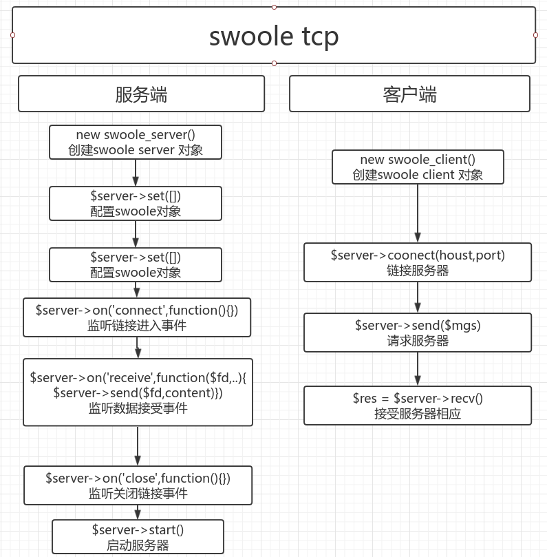
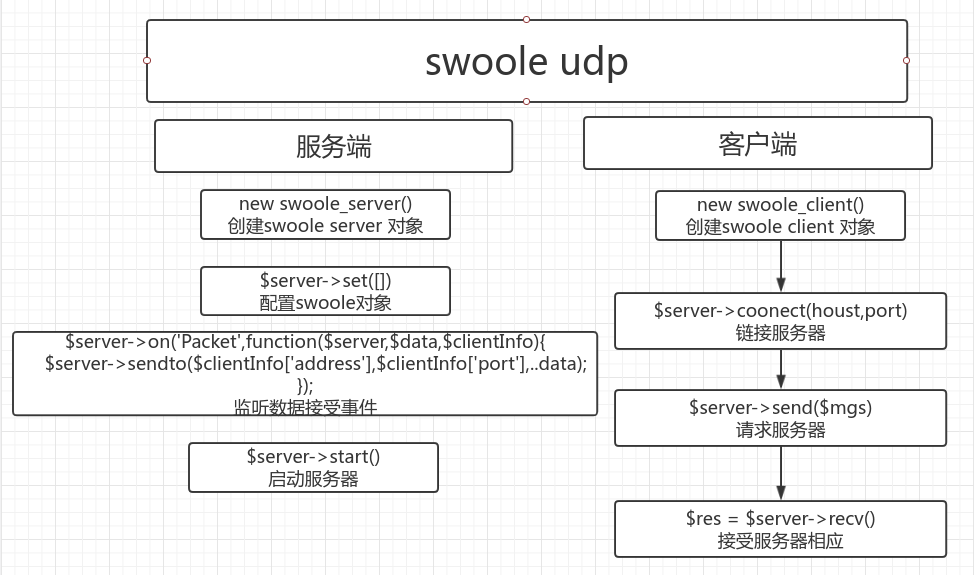
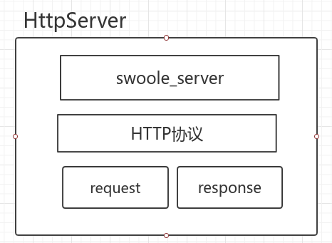

Swool 网络通讯
===

### alpine install php7
- `sed -i 's/dl-cdn.alpinelinux.org/mirrors.aliyun.com/g' /etc/apk/repositories`
- `apk update`
- `apk add vim wget tar`
- `wget http://cn2.php.net/distributions/php-7.2.16.tar.bz2`
- `tar -xjvf ...`
- `apk add build-base`
- `apk add gcc make automake autoconf libxml2 libxml2-dev`
- `./configure --prefix=/www/server/php7`
- `make && make install`
- `ln -s /www/server/php7/bin/php /usr/local/bin/`  or `vim /etc/profile` 尾部添加 `alias php=//www/server/php7/bin/php`
- `cp php.ini-production /www/server/php7/lib/php.ini`
- `php -i | grep php.ini`
### alpine install swoole
- `apk add git`
- `git clone https://gitee.com/swoole/swoole.git`
- `/www/server/php/bin/phpize`
- `./configure --with-php-config=/www/server/php7/bin/php-config`
- `make && make install`


#### swoole php7 双剑合璧
- 配置php.ini
- vim php.ini 加入 `extension=swoole`


##### OR Apk install `https://www.cyberciti.biz/faq/how-to-install-php-7-fpm-on-alpine-linux/`
 


### 1.tcp服务器
- tcp.php
- 查看是否运行程序与端口占用
```
netstat -anp | grep 9501
```
- 链接 telnet 127.0.0.1 5500
- 查看开启了多少进程 `ps aft | grep tcp.php`

`$client = new swoole_client(SWOOLE_SOCK_TCP);`
### udp

### httpServer

```
// 配置
$http->set([
    'enable_static_handler' => true, // 解析静态资源
    'document_root' => '/home/wangye/github/Swoole-Study/network/data', // 静态资源目录
]);
```
### WebSocket
- 允许服务器主动发送信息给客户端 (基于TCP全新网络协议,实现全双工通讯)
- 为什么药使用WebSocker
    - 缺陷 HTTP的通讯只能有客户端发送
    - 特点
        - 建立在TCP协议之上
        - 性能开销小通讯高效
        - 客户端可以与任意服务器通讯
        - 协议标识符ws wss
        - 持久化网络通讯协议  长连接
        


### 进程
- 正在运行程序的一个实例

### 携程


### php4种回调函数写法
- 匿名函数
```
$server->om('Request',function($req,$resp){
    echo '匿名函数';
})
```
- 类静态方法
```
class A
{
    static function test($req,$resp) {
        echo "类静态方法"
    }
}
$server->on('Request','A::Test');
$server->on('Request',array('A','Test'));
```
- 函数
```
function my_onRequest($req,$resp) {
    echo '函数';
}
$server->on('Request','my_onRequest');
```
- 对象方法
```
class A
{
    function test($req,$resp) {
        echo '对象方法';
    }
}
$object = new A();
$server->on('Request',array($object,'test'));
```

### WebSocket服务
- websocket协议 基于TCP. 实现浏览器与服务端全双工(full-duplex)通讯, 允许服务端主动与客户端通讯
- 特点
    - 建立在TCP协议之上
    - 性能开销小通讯搞笑
    - 客户端可以与任意服务器通讯
    - 协议标识符 ws wss
    - 持久化网络通讯协议
    
### Swoole Task 任务
- 使用场景
    - 执行耗时操作 (发送邮件,广播)
- 使用
    - onTask
    - onFinish
    - 设置task_worker_num 
